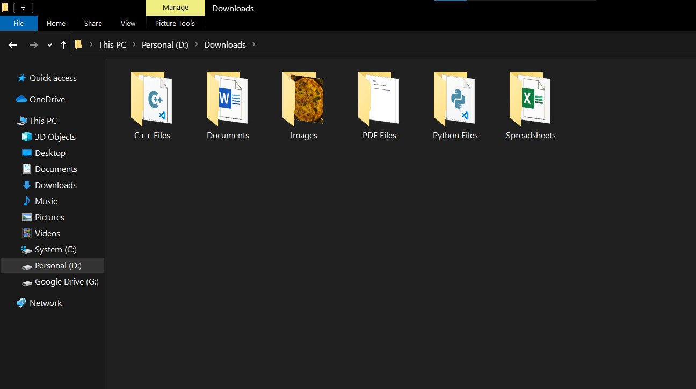

# File Organizer

This project comes in handy for people who keep most of their files and folders at one location. Using this project, all the files are organized in a well-manner within a blink of an eye.

## Libraries Used

* shutil
* os

## Run Locally

Clone the project

```bash
  git clone https://github.com/akanksha-raghav/Hacktoberfest2021
```

Go to the project directory

Go to `Hacktoberfest2021\Projects\File Organizer` and copy the `main.py` file to the haphazard directory.

Run it.

```python
  python main.py
```

The directory will now be organized.


